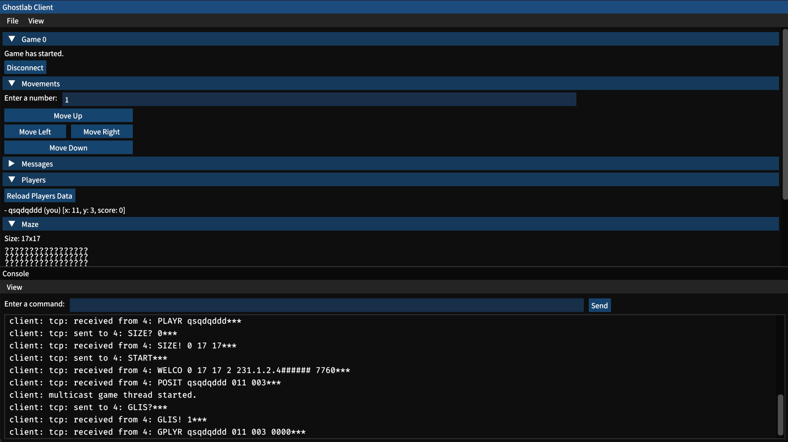
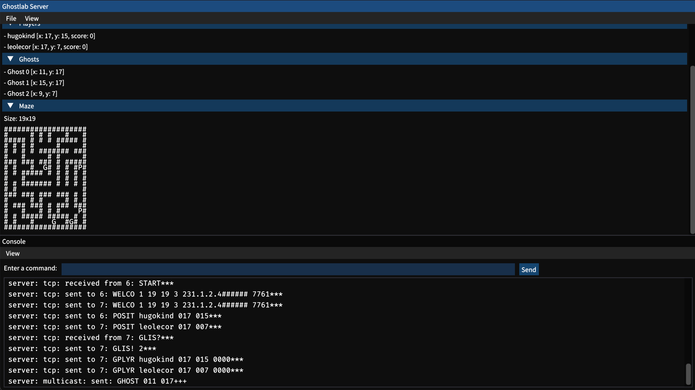
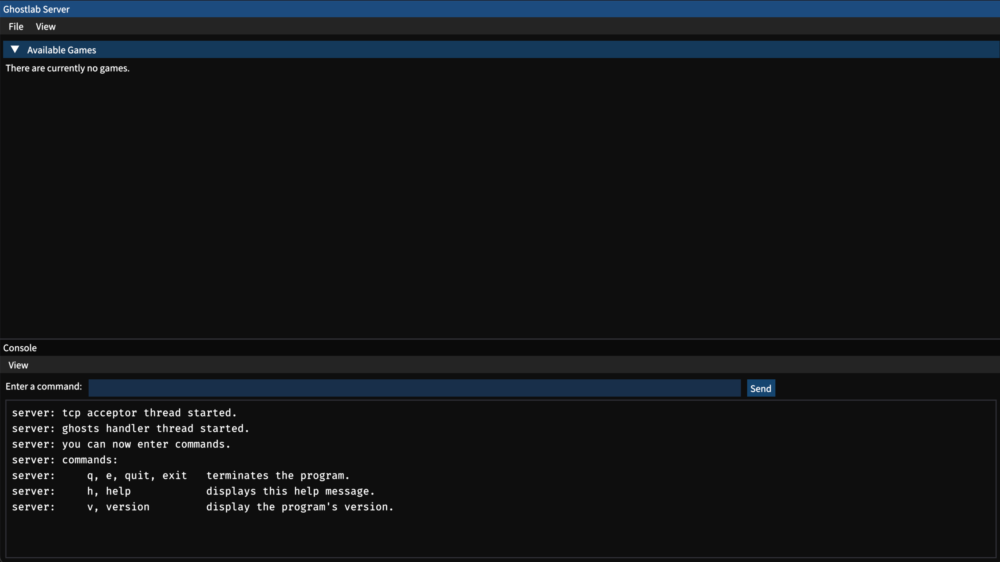

  

# Ghostlab

Ghostlab is an online matchmaking based game where you take upon yourself to become the best ghost hunter!

## Screenshots

    
    
    

## Features

- Chase ghosts through randomly generated perfect mazes.
- Interactive console.
- Advanced graphical user interface (made with ImGui).
- Terminal user interface for maximum compatibility (made with ImTui).
- Robust network architecture.
- Server made in C.
- Client made in both C and Java.
- Works on Linux (Ubuntu/Debian), macOS and Windows (WSL).

## Architecture

The architecture uses the concept of concurrency to be able to use only blocking sockets:

### In Common

- Main thread: Draws and handles interactions with the user interface (in a loop which should run at least 60 times per second).

### Server

- TCP Acceptor Thread: Waits and accepts new clients (on a TCP socket).
- TCP Listener Thread: Waits and handles a client's messages (on a TCP connected socket).
- Ghosts Handler Thread: Moves a random quantity of ghosts for each game in progress, after a random time (between 30 seconds and 90 seconds).

### Client

- TCP Listener Thread: Waits and handles the server's messages (on a TCP socket).
- UDP Listener Thread: Waits and handles the UDP client socket's messages.
- Game Multicast Listener Thread: Waits and handles the Game Multicast's messages (this type of message can be send by the server to reach every connected clients of a specific game in progress).

#### C Sources Only

- General Multicast Listener Thread: Waits and handles the General Multicast's messages (this type of message can be send by the server to reach every connected clients).

## How To Use

### Compile And Launch (C Sources)

The C sources uses CMake as a cross-platform build system, be sure to have it installed.

#### Install Dependencies

##### Linux (Ubuntu/Debian)

- Run `sudo apt-get install libncurses5-dev libsdl2-dev`.

##### macOS

- Run `brew install sdl2`.

#### Compile

- Open a terminal in the project's root directory.
- Run `mkdir ./c/build && cd ./c/build && cmake ./.. && make && cd ./../..` to generate the build configuration and compile.

#### Launch Server

- Run `./c/build/server_gui` to launch the server in GUI mode.
- Alternatively, run `./c/build/server_tui` to launch th server in TUI mode.

#### Launch Client

- Run `./c/build/client_gui` to launch the client in GUI mode.
- Alternatively, run `./c/build/client_tui` to launch the client in TUI mode.

You should **always** run the server before the client.  
The recommended user interface to launch with is the **GUI**.  
  
The TUI is mostly there for compatibility reasons and can be less stables due to the use of not thoroughly tested third party libraries that tends to have issues depending on your OS. If using this mode, do not quit the program through Ctrl+C or ncurses might bug! Use the quit button located in the file menu bar on the top-left of the window.

### Compile And Launch (Java Sources)

The Java sources uses Gradle as a cross-platform build system, it should install itself automatically when compiling the project.

#### Launch Server

- Open a terminal in the project's root directory.
- Run `./c/build/server_gui -l` to launch the server in GUI mode with only the recquired protocol.
- Alternatively, run `./c/build/server_tui -l` to launch th server in TUI mode only the recquired protocol.

#### Compile

- Open an other terminal in the project's root directory.
- Execute `cd java` in your shell.
- Run `./gradlew build` to compile the code.

#### Launch Client

- Run `./gradlew run` to run the Java version of the client.
- Alternatively, run with options `./java/gradlew run --args="<option> <argument> ..."` to run the Java version of the client with arguments
  (see all type of argument in `./java/ghostlab/Main.java`).

## Dependencies

### C Sources

- [ImGui](https://github.com/ocornut/imgui)
- [cimgui](https://github.com/cimgui/cimgui)
- [ImTui](https://github.com/ggerganov/imtui)
- [cimtui](https://github.com/hugokindel/school-uni-pr6/tree/main/c/deps/cimtui) (made especially for this project)
- [ncurses](https://invisible-island.net/ncurses)
- [SDL](https://www.libsdl.org/index.php)
- [OpenGL](https://www.opengl.org)

### Java Sources

- [ImGui](https://github.com/ocornut/imgui)
- [imgui-java](https://github.com/SpaiR/imgui-java)
- [LWJGL](https://www.glfw.org/)
- [GLFW](https://www.lwjgl.org/)
- [OpenGL](https://www.opengl.org/)

## Contributors

- [LE CORRE Léo](https://github.com/KarmaEssence)
- [JAUROYON Maxime](https://github.com/Maxime-Jauroyon)
- [KINDEL Hugo](https://github.com/hugokindel)

## License

This project is made for educational purposes only and any part of it can be used freely.
